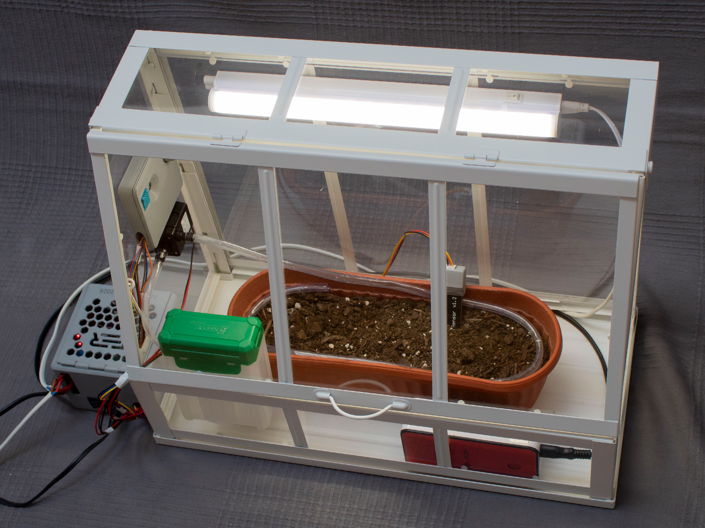
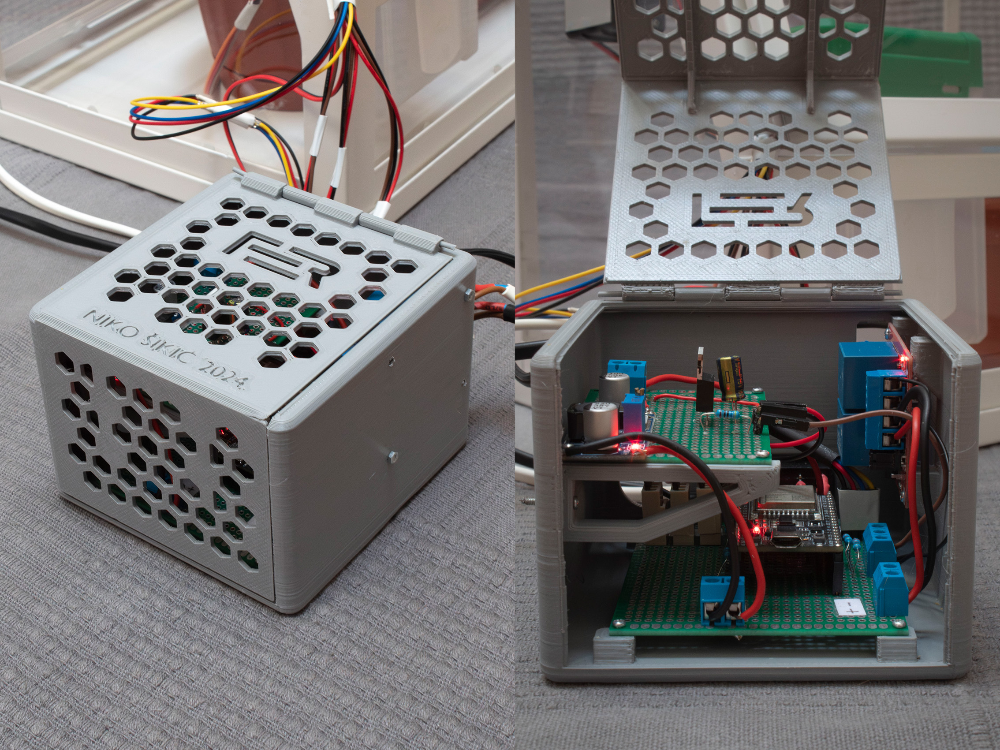
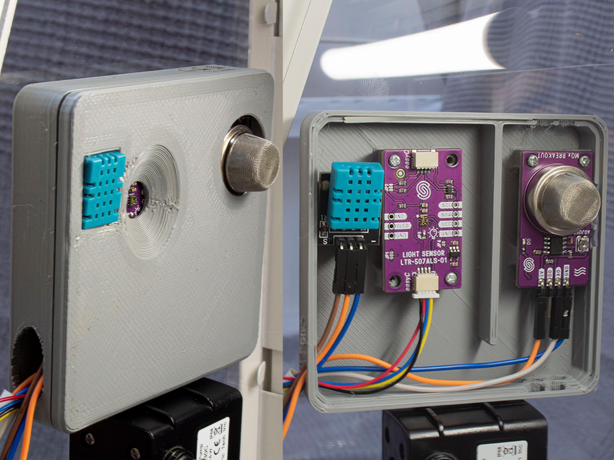
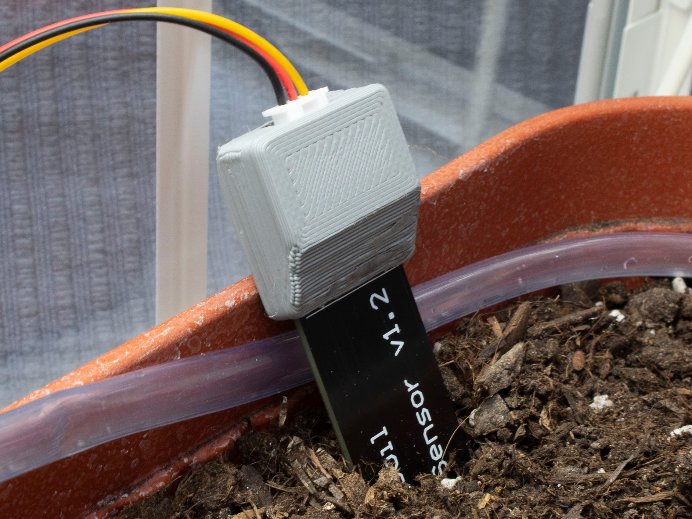

# 🌱 Autonomous Greenhouse — ESP32 IoT System

> **Real-time monitoring and automatic regulation of microclimatic conditions in a plant growth enclosure, powered by ESP32 and the ESP RainMaker cloud platform.**

---

## What is this?

This project is a fully functional smart greenhouse system built around the **ESP32 microcontroller (ESP32-DevKitC V4)** and Espressif's **ESP-IDF** framework. It monitors and automatically controls the key environmental parameters that determine whether your plants thrive — all accessible from your phone, from anywhere in the world.

The system continuously reads five environmental parameters, sends the data to the cloud, and fires up actuators autonomously to keep conditions optimal — no human intervention required.

---

## 📸 Demo — Physical Build

<p align="center">
  
  
  
  
</p>

---

## 📐 System Architecture

<p align="center">
  
  
</p>

---

## ⚙️ What it monitors & controls

| Parameter | Sensor | Actuator |
|---|---|---|
| 🌡️ Air temperature | DHT11 | Electric heater |
| 💧 Air humidity | DHT11 | — |
| 🌿 CO₂ concentration | MQ-135 | — |
| 🪴 Soil moisture | Capacitive sensor v1.2 | Water pump |
| 💡 Light intensity | LTR-507-ALS-01 | LED grow light |

---

## 📱 Remote Access via ESP RainMaker

The system connects over **Wi-Fi** and streams sensor data to the **ESP RainMaker cloud**. Through the mobile app you can:

- View live and historical sensor readings (plotted over time)
- Set target temperature and soil moisture thresholds
- Manually toggle the LED grow light
- Schedule actuators based on time of day
- Get notified of parameter changes

---

## 🎬 Demo Video

> 📁 **[Watch the demo here →](https://drive.google.com/file/d/1RN_uDvcak08naD7JZQC7uZy4IQwOXqrC/view?usp=sharing)**

---

## 📄 Full Documentation

The complete written thesis (hardware design, sensor calibration, firmware architecture, and test results) is available in the repository:

📘 **[`Tekst/Sikic_Niko_Zavrsni_projekt.pdf`](Tekst/Sikic_Niko_Zavrsni_projekt.pdf)**

---

## 🛠️ Tech Stack

- **Microcontroller:** ESP32-DevKitC V4 (ESP32-WROOM-32E)
- **Framework:** ESP-IDF (C)
- **Cloud platform:** ESP RainMaker (MQTT over TLS)
- **Protocols:** 1-Wire (DHT11), I²C (LTR-507), ADC (MQ-135, soil sensor)
- **Control logic:** On/Off (bang-bang) regulation with FreeRTOS timers
- **Enclosures:** Custom-designed in Blender, 3D printed

---

## 📁 Firmware Structure

```
main/
├── app_main.c
├── app_driver.c
├── DHT11.c / .h
├── LTR-507.c / .h
├── MQ-135.c / .h
├── soil_moisture.c / .h
└── device.c / .h
```

---

*Bachelor's thesis — Faculty of Electrical Engineering and Computing (FER), University of Zagreb, 2024.*  
*Author: Niko Šikić | Mentor: Prof. dr. sc. Hrvoje Džapo*
